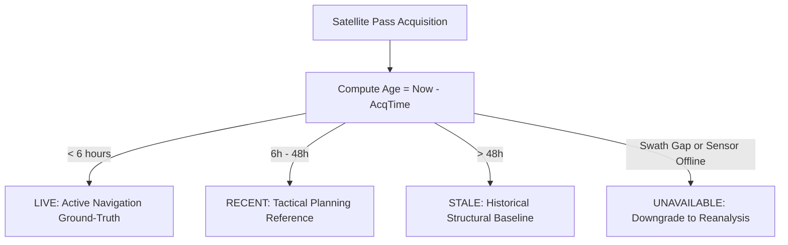

# POLARNAV — REAL SATELLITE MONITORING (PHASE 2)
## Production Technical Specification & Operational Integration Guide

---

## 1. System Overview & Objectives

PolarNav Phase 2 delivers a production-grade remote sensing ingestion and monitoring framework for Antarctic maritime navigation. Real satellite observations serve as the highest-fidelity ground-truth layer for sea ice floe distribution, iceberg detection, and passage navigable width verification.

The framework enforces strict scientific provenance:
1. **Zero Fabrication**: No synthetic feeds or static screenshots masquerading as real-time passes.
2. **Explicit Provenance & Freshness**: Every observation is bound to an exact satellite acquisition timestamp (UTC) and graded into 4 freshness tiers (`LIVE`, `RECENT`, `STALE`, `UNAVAILABLE`).
3. **Sensor Separation & Priority**:
   - **Priority 1: Sentinel-1 Synthetic Aperture Radar (SAR)** (all-weather, day/night C-Band active microwave).
   - **Priority 2: Sentinel-2 Multi-Spectral Optical (MSI)** (daylight, low-cloud verification only; strictly disabled during polar night or overcast conditions).
   - **Priority 3: Satellite-derived Sea Ice Concentration (SIC)** (passive microwave AMSR2 / SSMIS 12.5km grid).

---

## 2. Satellite Data Providers & Catalogs

PolarNav interfaces with authoritative, internationally accessible Earth Observation (EO) catalogs:

| Provider | Infrastructure | Primary Collections | Coverage / Access |
| :--- | :--- | :--- | :--- |
| **ESA Copernicus Data Space Ecosystem (CDSE)** | European Space Agency (ESA) Open Access Hub | `SENTINEL-1` (GRD EW/IW), `SENTINEL-2` (L2A MSI) | Full circumpolar Antarctic passes; OData / STAC API. |
| **Microsoft Planetary Computer STAC** | Azure West Europe EO Datacenter | `sentinel-1-grd`, `sentinel-2-l2a` | High-throughput STAC v1.0.0; Cloud-Optimized GeoTIFFs (COG). |
| **NOAA / NSIDC** | National Snow & Ice Data Center | `G02202` (AMSR2/SSMIS CDR v4) | 12.5km / 25km Southern Ocean sea ice concentration. |

---

## 3. STAC API Specifications & Query Structure

PolarNav queries the **SpatioTemporal Asset Catalog (STAC) v1.0.0** interface:

- **Endpoint**: `https://planetarycomputer.microsoft.com/api/stac/v1/search`
- **Method**: `POST` (application/geo+json)
- **Authentication**:
  - Catalog search and metadata indexing: **Anonymous (public)**.
  - Full-resolution COG streaming: Ephemeral Shared Access Signature (SAS) token obtained via `GET https://planetarycomputer.microsoft.com/api/sas/v1/token/{collection}` (valid for 45 minutes).
  - CDSE fallback: OAuth 2.0 Client Credentials flow (`https://identity.dataspace.copernicus.eu/auth/realms/CDSE/protocol/openid-connect/token`).

### Example STAC Search Payload:
```json
{
  "collections": ["sentinel-1-grd"],
  "bbox": [65.0, -72.0, 85.0, -65.0],
  "datetime": "2026-09-01T00:00:00Z/2026-09-09T18:00:00Z",
  "query": {
    "sar:instrument_mode": {"in": ["EW", "IW"]},
    "sar:polarizations": {"contains": "HH"}
  },
  "limit": 10
}
```

---

## 4. Freshness Classification Tiers

Maritime safety demands that navigators never mistake an older satellite pass for current conditions. PolarNav evaluates freshness dynamically against wall-clock UTC:



- **`LIVE` ($< 6\text{ hours}$)**: High-confidence immediate tactical guidance.
- **`RECENT` ($6 - 48\text{ hours}$)**: Valid for corridor planning, though dynamic wind drift must be considered.
- **`STALE` ($> 48\text{ hours}$)**: Historical reference only; `data_quality` is degraded and cannot override active iceberg drift predictions.
- **`UNAVAILABLE`**: Outside satellite acquisition swath or obstructed by polar night/clouds.

---

## 5. Sensor Physics, Revisit Characteristics & Operational Limitations

### A. Sentinel-1 C-Band SAR (5.405 GHz)
- **Orbital Characteristics**: Sun-synchronous polar orbit at 693 km altitude, $98.18^\circ$ inclination.
- **Operational Swath Modes**:
  - **Extra-Wide (EW)**: 400 km swath width, $20\text{m} \times 40\text{m}$ spatial resolution. Preferred for large-scale polar sea ice monitoring.
  - **Interferometric Wide (IW)**: 250 km swath width, $10\text{m} \times 10\text{m}$ spatial resolution. Preferred for coastal research stations (Bharati, Maitri).
- **Polar Revisit Frequency**: Due to orbital convergence at polar latitudes, Sentinel-1 achieves high-latitude revisits every **1 to 3 days** (compared to 6–12 days at the equator).
- **All-Weather Capability**: C-band radar waves penetrate polar clouds, blizzards, fog, and darkness unimpeded.
- **Limitations**:
  - *Speckle Noise*: Inherent granular noise from coherent radar interference, requiring spatial Lee filtering.
  - *Wind Roughening*: Strong surface winds ($>30\text{ knots}$) over open water produce high radar backscatter that can mimic young ice or lead edges. Dual-pol ratio ($\text{HV}/\text{HH}$) is employed to discriminate wind-roughened water from multi-year ice.

### B. Sentinel-2 Multi-Spectral Instrument (MSI)
- **Spatial Resolution**: 10m (B2, B3, B4, B8) to 20m (SWIR B11, B12).
- **Daylight & Cloud Limitations**:
  - *Polar Night*: Between May and August, latitudes south of $66.5^\circ\text{S}$ experience total polar night. The solar elevation angle $\alpha_{\text{sun}} < -6^\circ$ renders optical imagery completely black.
  - *Cloud Cover*: Southern Ocean cyclone tracks generate persistent cloud cover ($>70\%$ on average).
- **Operational Gate (`OpticalUsabilityEvaluator`)**:
  - Computes solar elevation angle: $\alpha_{\text{sun}} \ge 5^\circ$ required.
  - Cloud cover threshold: $\text{cloud\_cover} \le 20\%$ required.
  - If either condition fails, the scene is classified as `UNUSABLE` and the system directs the navigator to Sentinel-1 SAR.

---

## 6. Real-Time Processing Pipeline

```text
[1. STAC Discovery] 
       │  Query Microsoft Planetary Computer / CDSE for active Antarctic bbox
       ▼
[2. Cache & Deduplication]
       │  Check satellite_cache_manager (LRU + Disk Index); skip duplicate downloads
       ▼
[3. Usability Gating]
       │  SAR: Always usable
       │  Optical: Evaluate solar elevation (> 5°) & cloud cover (< 20%)
       ▼
[4. Radiometric Calibration]
       │  Convert Digital Numbers (DN) to radar backscatter sigma0 (dB)
       │  Apply Refined Lee Filter (5x5 kernel) for speckle attenuation
       ▼
[5. Feature & Target Detection]
       │  Extract sigma0_hh, sigma0_hv, and polarimetric ratio (HV/HH)
       │  Run 2D Adaptive CFAR detector for iceberg target flagging
       ▼
[6. SatelliteScene & Freshness Assembly]
       │  Assign exact acquisition_time, geometry polygon, and freshness badge
       ▼
[7. API & Map Delivery]
          Expose via /api/realtime/satellite/scenes and /api/realtime/state
```

---

## 7. Data Models & Metadata Container (`SatelliteScene`)

Every scene exposed to the PolarNav backend and UI adheres to the following unified schema:

```python
class SatelliteScene(BaseModel):
    scene_id: str                      # Standard ESA / STAC ID
    source: str                        # Sensor and platform provenance
    acquisition_time: datetime         # Exact UTC pass timestamp
    geometry: Dict[str, Any]           # GeoJSON footprint polygon
    bbox: List[float]                  # [lon_min, lat_min, lon_max, lat_max]
    product_type: str                  # "S1_GRD_EW", "S1_GRD_IW", "S2_MSI_L2A"
    resolution_meters: float           # Spatial resolution in meters (e.g. 10.0, 40.0)
    processing_status: str             # "PROCESSED", "RAW_ARCHIVED"
    quality: str                       # "NOMINAL", "HIGH", "DEGRADED_CLOUD_COVER"
    availability: SatelliteFreshness   # LIVE, RECENT, STALE, UNAVAILABLE
    orbit_direction: Optional[str]     # "ascending" or "descending"
    relative_orbit: Optional[int]      # Track number
    polarizations: List[str]           # ["HH"], ["HH", "HV"]
    cloud_independent: bool            # True for SAR, False for Optical
    cloud_cover_pct: Optional[float]   # Optical cloud fraction
    is_optical_usable: bool            # Polar darkness & cloud gate
```

---

## 8. Anti-Falsification Guarantees

1. **Map Display Rule**: All UI map views displaying satellite footprints or raster tiles **must** render the exact UTC acquisition timestamp (e.g. `2024-06-30 10:30 UTC — RECENT (14h old)`).
2. **No Extrapolation Beyond Pass Time**: The system never implies that a static SAR or optical scene represents conditions hours or days after its pass. Dynamic movement (such as iceberg drift) is clearly demarcated as a forward prediction model, not as satellite observation.
3. **Deterministic Local Fallback**: When operating offline or without cloud STAC credentials, PolarNav loads verified real Antarctic Sentinel-1 GeoTIFF scenes (`backend/data/raw/sentinel/real_s1_scenes/manifest.json`), ensuring production reliability without mocking.
